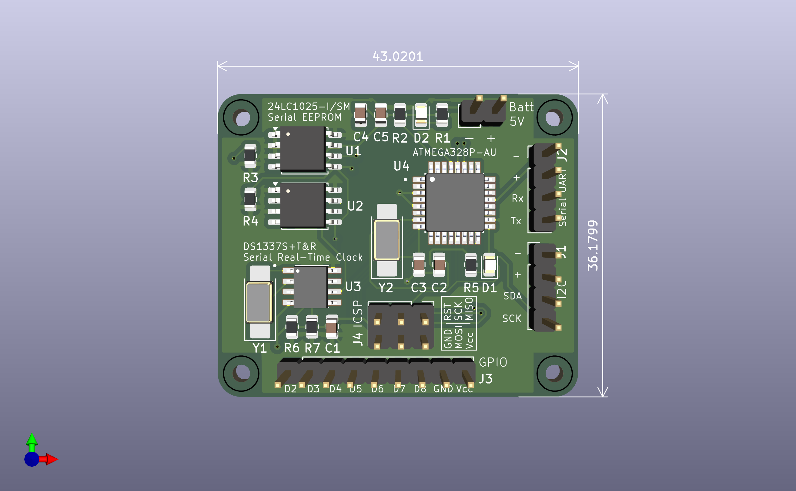
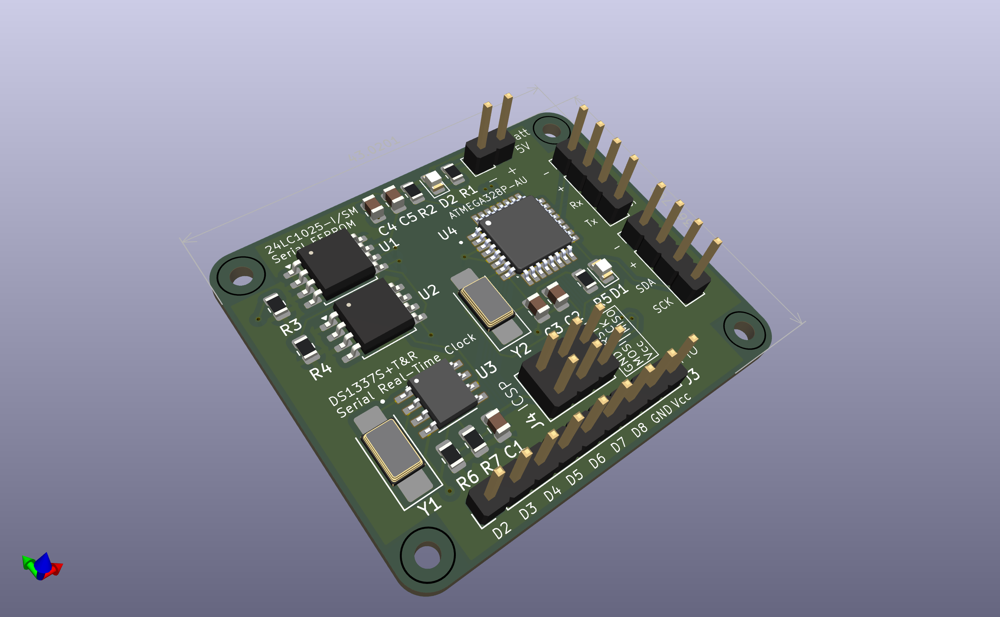
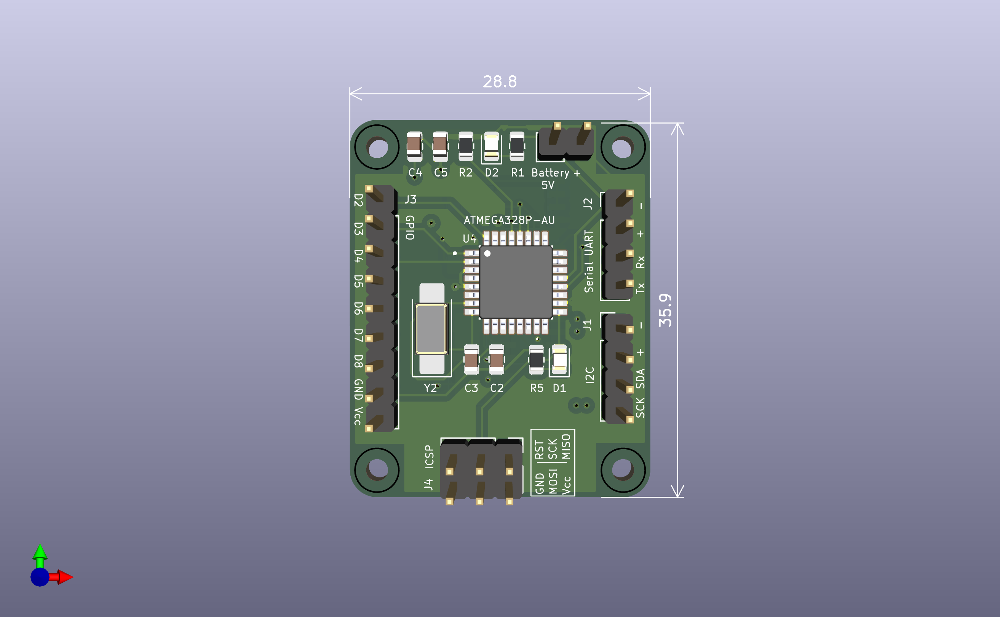
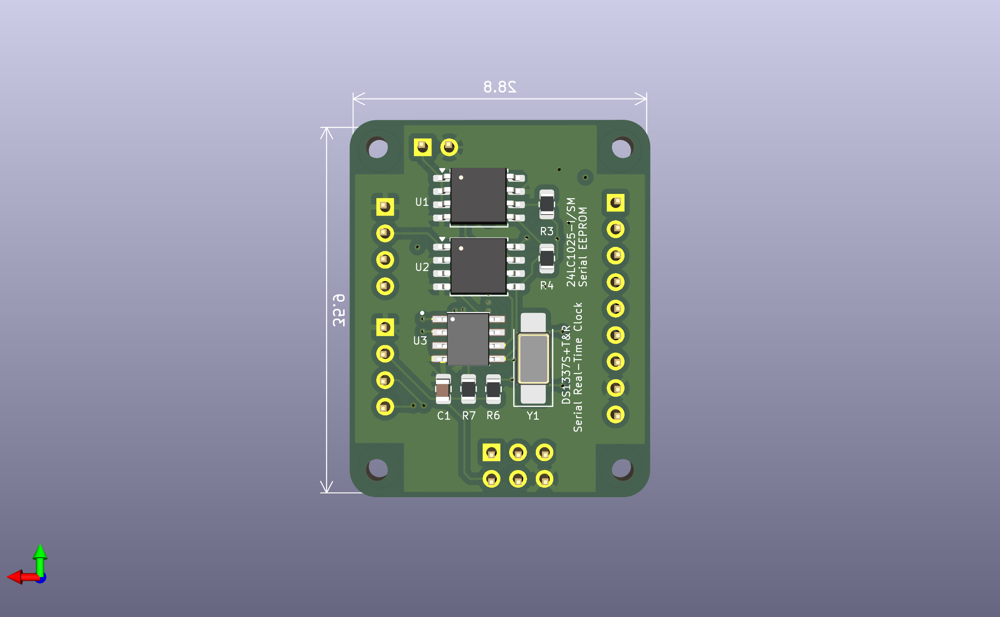
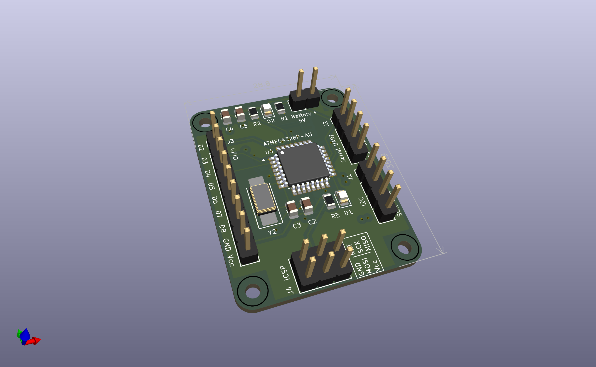

# MCU Data Logger

The MCU Data Logger is a compact ATmega328P-based board designed with integrated real-time clock and EEPROM storage, providing a foundation for timestamped data collection from external sensors and peripherals. This project demonstrates two PCB design revisions, showcasing both a traditional two-layer layout and a more advanced four-layer compact layout. The goal of this board is to practice designing microcontroller-based hardware, integrating I2C peripherals, and producing increasingly complex PCB layouts as part of a broader progression toward custom embedded hardware development.

---

## Schematic

The circuit integrates three primary components: the ATmega328P-AU microcontroller, a DS1337S real-time clock with 32.768 kHz crystal, and two 24LC1025 EEPROMs for non-volatile storage. Each device communicates over I2C, with breakout headers provided for GPIO, UART programming, ICSP, and battery or 5 V power input.

**Schematic PDF:** [Schematic PDF](ReadmeResources/PcbSchematicMainPage.pdf)

---

## Two-Layer PCB Revision

This version uses a two-layer board with components placed on a single side, following a more traditional layout approach. It offers clear routing, easier hand assembly, and a straightforward component arrangement appropriate for early prototyping.

### 3D Model Views

#### Front View

#### Angled View

### PCB Layout

**2-Layer PCB Layout PDF:** [Layout Document](`ReadmeResources/2LayerPcbLayout.pdf`)

---

## Four-Layer PCB Revision

The four-layer revision introduces a more compact footprint with components on both sides and a denser routing strategy. This version leverages additional layers for power, ground, and signal separation, providing an opportunity to practice modern multi-layer design techniques.

### 3D Model Views

#### Front View

#### Back View

#### Angled View

### PCB Layout

**4-Layer PCB Layout PDF:** [Layout Document](`ReadmeResources/4LayerPcbLayout.pdf`)

